# Strategy Flow Diagrams

## Bull Put Spread — Scanner + Exit Monitor

```mermaid
flowchart TD
    subgraph SCHEDULER["Every 15 min (MON-FRI 03:00–15:00 ET)"]
        T1([Scanner triggered])
    end

    subgraph MONITOR["Every 60 seconds"]
        M1([Monitor triggered])
    end

    T1 --> C1{IBKR connected?}
    C1 -- no --> SKIP1([skip])
    C1 -- yes --> C2{any exchange\nopen?}
    C2 -- no --> SKIP2([skip])
    C2 -- yes --> C3{open spreads\n≥ maxOpenSpreads?}
    C3 -- yes --> SKIP3([skip])
    C3 -- no --> LOOP

    subgraph LOOP["For each active symbol in Universe (exchange-hours filtered)"]
        L0{in-flight,\ncooling down,\nor open spread?}
        L0 -- yes --> NEXT([next symbol])
        L0 -- no --> L1[ScanCandidateSelector:\nIV rank, expiry, option chain,\ndelta, credit, risk checks]
        L1 --> C4{candidate\nselected?}
        C4 -- no → reason logged --> NEXT
        C4 -- yes --> O1[fire-and-forget:\nTradeExecutionService.execute]
        O1 --> NEXT
    end

    subgraph EXEC["TradeExecutionService (coroutine)"]
        E1[Submit BAG combo\nlimit order]
        E1 --> E2{event loop\nuntil filled or timeout}
        E2 -- drift > 5% underlying --> E3[cancel → DRIFT_ABORTED\ncooldown 4h]
        E2 -- ticks × interval elapsed --> E4{credit above\nfloor?}
        E4 -- no --> E5[FLOOR_REACHED\ncooldown 4h]
        E4 -- yes --> E6[lower price 1 tick\nreplace order]
        E6 --> E2
        E2 -- FILLED --> DB1[(persist BullPutSpread\nto PostgreSQL)]
        E2 -- timeout → E7[cancel → TIMED_OUT\ncooldown 4h]
    end

    subgraph EXIT["checkExits — for each open/closing spread"]
        M1 --> M2{IBKR connected?}
        M2 -- no --> SKIP4([skip])
        M2 -- yes --> M3{isAnyExchangeOpen?\n(config-driven)}
        M3 -- no --> SKIP5([skip])
        M3 -- yes --> E10[fetch mid for sold + bought put]
        E10 --> C12{spread value\n≤ credit × 50%?}
        C12 -- yes --> CLOSE_TP[MARKET close → CLOSED_PROFIT]
        C12 -- no --> C13{spread value\n≥ credit + credit × 100%?}
        C13 -- yes --> CLOSE_SL[MARKET close → CLOSED_STOP]
        C13 -- no --> C14{DTE ≤ 14?}
        C14 -- yes --> CLOSE_TIME[MARKET close → CLOSED_TIME]
        C14 -- no --> HOLD([hold — store lastSpreadValue])
        CLOSE_TP & CLOSE_SL & CLOSE_TIME --> DB2[(update spread in PostgreSQL)]
    end
```

---

## Bull Flag — Pattern Detection + Execution

```mermaid
flowchart TD
    subgraph STARTUP["ApplicationReadyEvent"]
        S1[Fetch 3-day historical 5-min bars\nreqHistoricalData]
        S1 --> S2[Replay through PatternDetector\n— primes FSM state]
        S2 --> S3[Subscribe reqRealTimeBars\n5-sec bars RTH only]
    end

    subgraph BAR_LOOP["Per 5-sec bar"]
        B1[Update high/low watermarks\nfor any open position]
        B1 --> B2[Aggregate into 5-min candle]
        B2 --> B3{60 bars complete\n= new 5-min bar?}
        B3 -- yes --> B4[Write to InfluxDB\nFeed PatternDetector.onNewBar]
        B3 -- no --> B5[Check live breakout\non current FlagForming state]
        B4 --> B6{BreakoutReady?}
        B5 --> B7{liveClose > resistance?}
        B6 -- yes: FIVE_MIN breakout --> QUAL
        B7 -- yes: LIVE_BAR breakout --> QUAL
    end

    subgraph QUAL["Quality filters (maybeEnter)"]
        Q1{scanner enabled?}
        Q1 -- no --> RESET([reset detector])
        Q1 -- yes --> Q2{entry blocked\n< N min to close?}
        Q2 -- yes --> RESET
        Q2 -- no --> Q3{first 90 RTH\nmin passed?}
        Q3 -- no --> RESET
        Q3 -- yes --> Q4{channel slope\nnegative?}
        Q4 -- no if required --> RESET
        Q4 -- yes --> Q5{pole/ATR ratio\nin 2.0–4.0×?}
        Q5 -- no --> RESET
        Q5 -- yes --> Q6{retracement\n≥ 25%?}
        Q6 -- no --> RESET
        Q6 -- yes --> Q7{flag bars\n≥ 7?}
        Q7 -- no --> RESET
        Q7 -- yes --> MUTEX
    end

    subgraph MUTEX["entryMutex (TOCTOU guard)"]
        M1{open + pending\n≥ maxOpenPositions?}
        M1 -- yes --> RESET
        M1 -- no --> M2[reset detector\nsubmit to FlagExecutionService]
    end

    subgraph EXEC["FlagExecutionService"]
        X1[Calculate shares =\nriskPerTrade / stopDistance]
        X1 --> X2[Bracket order:\nstop-market BUY DAY\nSL stop-market SELL GTC\nPT limit SELL GTC OCA]
        X2 --> X3[Persist FlagPosition PENDING]
        X3 --> X4[Await parent fill\nup to 10h]
        X4 -- FILLED --> X5[Update to OPEN\nrecord actualEntryPrice slippage]
        X4 -- cancelled/timeout --> X6[Mark ENTRY_TIMEOUT]
        X5 --> X7[Parallel: await SL fill / PT fill\nwhichever completes first]
        X7 -- SL --> X8[CLOSED_STOP]
        X7 -- PT --> X9[CLOSED_PROFIT]
    end

    subgraph EOD["FlagMonitorScheduler (every 60s)"]
        E1{within eodLiqMinutes\nbefore EU close?}
        E1 -- yes --> E2[checkEodLiquidation EU]
        E3{within eodLiqMinutes\nbefore US close?}
        E3 -- yes --> E4[checkEodLiquidation US]
        E2 & E4 --> E5[cancel SL + PT orders\nmarket SELL open equity positions]
        E5 --> E6[CLOSED_EOD]
    end
```



---

## Pattern FSM States

```
Idle
  └─ (pole detected: height ≥ 2×ATR, volume spike) ──► FlagpoleDetected
       └─ (consolidation bars ≥ flagMinBars, retracement ≤ 50%, channel slope ≤ 0) ──► FlagForming
            ├─ (bar close > upper resistance) ──► BreakoutReady ──► [entry / reset]
            ├─ (retracement > 50% OR bars > 20) ──► Idle (reset)
            └─ (still consolidating) ──► FlagForming (updates channel regression)
```
