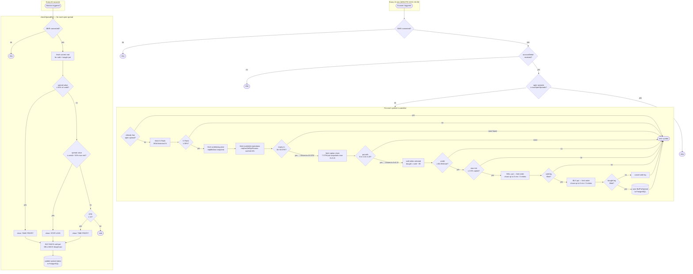

# Strategy Flow — Bull Put Spread (Volatility Hunter v1)

```mermaid
flowchart TD
    subgraph SCHEDULER["Every 15 min (MON-FRI 10:00–15:00)"]
        T1([Scanner triggered])
    end

    subgraph MONITOR["Every 60 seconds"]
        M1([Monitor triggered])
    end

    T1 --> C1{IBKR connected?}
    C1 -- no --> SKIP1([skip])
    C1 -- yes --> C2{accountDetail\nreceived?}
    C2 -- no --> SKIP2([skip])
    C2 -- yes --> C3{open spreads\n≥ maxOpenSpreads?}
    C3 -- yes --> SKIP3([skip])
    C3 -- no --> LOOP

    subgraph LOOP["For each symbol in watchlist"]
        L0{already has\nopen spread?}
        L0 -- yes --> NEXT([next symbol])
        L0 -- no --> L1[fetch IV Rank\n365d historical IV]
        L1 --> C4{IV Rank\n≥ 30%?}
        C4 -- no --> NEXT
        C4 -- yes --> L2[fetch underlying price\nreqMktData snapshot]
        L2 --> L3[fetch available expirations\nreqSecDefOptParams cached 24h]
        L3 --> C5{expiry in\n30–50 DTE?}
        C5 -- none found --> NEXT
        C5 -- yes → closest to 45 DTE --> L4[fetch option chain\n7 OTM put snapshots near δ=0.15]
        L4 --> C6{put with\nδ in 0.10–0.20?}
        C6 -- none --> NEXT
        C6 -- yes → closest to δ=0.15 --> L5[sold strike selected\nbought = sold − $5]
        L5 --> C7{credit\n≥ $0.30/share?}
        C7 -- no --> NEXT
        C7 -- yes --> C8{max risk\n≤ 2.5% capital?}
        C8 -- no --> NEXT
        C8 -- yes --> O1[SELL put — limit order\nchase up to 5 min / 3 retries]
        O1 --> C9{sold leg\nfilled?}
        C9 -- no --> NEXT
        C9 -- yes --> O2[BUY put — limit order\nchase up to 5 min / 3 retries]
        O2 --> C10{bought leg\nfilled?}
        C10 -- no --> O3[cancel sold leg]
        O3 --> NEXT
        C10 -- yes --> DB1[(save BullPutSpread\nto PostgreSQL)]
        DB1 --> NEXT
    end

    subgraph EXIT["checkSpreadExit — for each open spread"]
        M1 --> C11{IBKR connected?}
        C11 -- no --> SKIP4([skip])
        C11 -- yes --> E1[fetch current mid\nfor sold + bought put]
        E1 --> C12{spread value\n≤ 50% of credit?}
        C12 -- yes --> CLOSE_TP[close: TAKE PROFIT]
        C12 -- no --> C13{spread value\n≥ credit + 50% max risk?}
        C13 -- yes --> CLOSE_SL[close: STOP LOSS]
        C13 -- no --> C14{DTE\n≤ 14?}
        C14 -- yes --> CLOSE_TIME[close: TIME PROFIT]
        C14 -- no --> HOLD([hold])
        CLOSE_TP & CLOSE_SL & CLOSE_TIME --> CL1[BUY BACK sold put\nSELL BACK bought put]
        CL1 --> DB2[(update spread status\nin PostgreSQL)]
    end
```
